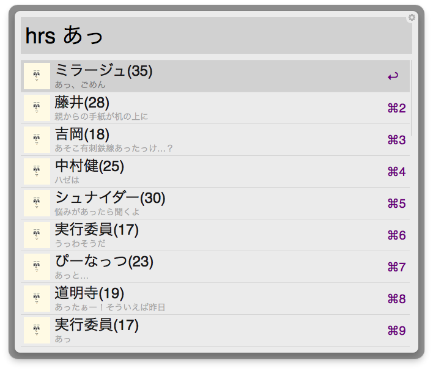

惚れさせ男子 for [Alfred 2](http://www.alfredapp.com/)
========================

[惚れさせ男子データベース](https://github.com/june29/horesase-boys)のデータを使用しています。

``hrs {任意のワード}``で、お好きな惚れさせ男子の画像のURLをクリップボードに入れることができます。



## 使い方

Enterで画像のURLをクリップボードにコピーします。

```
hrs kazしてEnter
http://jigokuno.img.jugem.jp/20090111_795235.gif
```

Cmd+Enterでマークダウン形式で、クリップボードにコピーします。
```
hrs kazしてCmd+Enter

```

## ダウンロード

[DOWNLOAD](https://github.com/geckotang/alfred-horesase-workflow/releases) からダウンロードして、インストールしてください。
